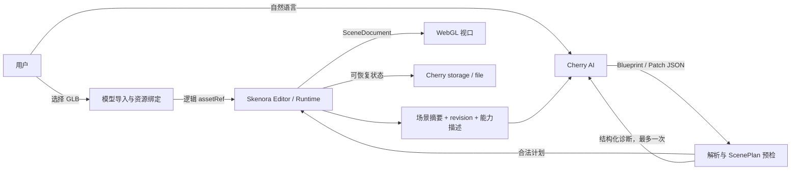

# 模型布景开发方案

> 状态：v0.3.11 已实现，待 Cherry Studio 内人工验收  
> 版本：0.3.11  
> 更新日期：2026-08-31

## 0. 当前落地结果

v0.3.11 打开后提供纯黑背景的空工作区，只显示位于世界坐标 `Y=0` 平面的网格辅助线，不创建实体地面、展台或内置模型。右侧面板默认展示 AI 对话，切换到“场景”后展示场景树和当前节点属性。GLB/glTF 导入是主体进入场景的唯一入口；Skenora 0.1.2 会在 Cherry 的空来源沙箱中内嵌外部缓冲区和贴图，并将 AI 生成的完整候选文档转换成细粒度补丁，使普通镜头、灯光、材质和实体属性修改只投影受影响部分。未导入模型时仍可通过 Cherry AI 调整环境、灯光和镜头。

按仓库规则，Cherry Studio 内的手工 UI、WebGL 和真实模型提供商验收由用户执行。人工验收需覆盖黑色空工作区启动、原点网格、模型导入、连续对话和可见结果。

## 1. 决策摘要

模型布景是一款运行在 Cherry Studio 内的本地 3D 小程序。产品不生成模型，也不提供完整的专业建模界面：应用打开时保持空场景，只提供黑色背景、原点网格、灯光和镜头；用户导入自己的 GLB/glTF 后，Cherry AI 将自然语言转换为 Skenora 可校验、可执行的 `ScenePatch` JSON。

核心分工固定如下：

| 参与者 | 拥有的职责 | 明确不负责 |
| --- | --- | --- |
| 用户 | 选择本地模型、下达布景意图、确认导出 | 编写场景 JSON |
| Cherry AI | 根据场景摘要和能力描述生成 Blueprint/Patch；根据结构化诊断修复一次 | 生成或修改模型二进制、接触文件句柄和 Babylon 对象 |
| 模型布景 | UI、授权、资源逻辑 ID、上下文裁剪、解析、错误呈现、存档和生命周期 | 绕过校验直接修改场景 |
| Skenora | JSON 契约、校验、编译、事务、撤销、资源生命周期和渲染 | AI 提供商、聊天 UI、Cherry 权限 |
| Cherry Studio | 用户模型槽位、宿主权限、存储、文件导出、可见性事件 | 3D 场景语义和渲染实现 |

## 2. 产品目标

### 2.1 一句话价值

把自己的 3D 模型放进一个现成场景，然后用自然语言完成布景。

### 2.2 首版用户闭环

1. 打开小程序，确认纯黑背景和位于 `Y=0` 的网格，对话输入可用。
2. 选择本地 GLB/glTF，模型自动居中、落到原点网格并取景。
3. 输入“增加柔和轮廓光，镜头转到左前方”。
4. Cherry AI 返回 ScenePatch JSON；应用经 Skenora 预检后原子提交。
5. 视口显示结果，用户可以继续描述、查看 JSON、撤销或重做。
6. 用户可以显式导出场景 JSON。

### 2.3 目标界面


图是信息架构和视觉密度目标，不承诺模型本身由 AI 生成。最终视口必须以 Skenora 在 Cherry 沙箱中的真实输出为准。

## 3. 首版范围

### 3.1 必须完成

- 一个确定性的空 SceneDocument：纯黑背景、位于 `Y=0` 的网格辅助线、三点灯光、主镜头和轻量后期；不创建实体地面、展台或内置模型。
- 对话能力不依赖本地模型；通过浏览器文件输入导入用户 GLB/glTF，导入失败时保留空工作区或上一份有效模型。
- 为模型建立宿主拥有的逻辑资源 ID，绝不把 File、路径、Blob URL 或模型字节发送给 Cherry AI。
- 向 Cherry AI 提供精简的场景摘要、当前 revision、资源逻辑 ID、可用材质槽和 Skenora 能力描述。
- 接受带 revision 的 `ScenePatch`；不允许 AI 用完整 Blueprint 替换场景。
- 严格执行“解析/应用策略 → 预检 → 必要时修复一次 → 原子提交 → 投影”的流水线。
- 支持查看最近一次已应用 JSON、撤销、重做、重新取景和取消生成。
- AI 不可用时仍能查看黑色空工作区、导入模型、旋转视口和重置镜头。
- 保存对话、最近计划、场景 JSON 和模型元数据；应用隐藏时取消 AI、暂停预览并保存状态。重启后空工作区立即可用，本地模型需要重新选择，当前版本不自动恢复场景修改。
- 使用 Cherry 的主题变量，适配明暗主题和窄窗口。
- 构建静态 `dist/`，最终只生成开发版 `.miniapp` 包。

### 3.2 Skenora JSON 能力策略

产品不维护一份与 Skenora 平行的手写场景字段清单。运行时从 `describeSceneCapabilities()` 和观测到的 capability availability（能力可用性，即当前运行环境实际支持的能力与限制）生成 AI 上下文和校验条件。

首版 UI 重点引导以下高频能力：

- 模型 transform、显隐和材质绑定；
- environment、ground、fog、weather；
- lights、camera、camera paths；
- post-process；
- PBR 材质、渐变、轮廓光、溶解和材质参数动画；
- annotation、particle、texture animation；
- Skenora 已声明并启用的其他 ScenePlan JSON 能力。

Flow 和模型内置动画可以被 JSON 引用，但自动播放必须经过应用策略允许；未知、禁用或超预算的能力由 Skenora 拒绝，不能由应用静默降级成任意代码。

### 3.3 首版不做

- 不生成、重拓扑、雕刻或编辑模型网格。
- 不生成贴图文件，不接入外部模型或图片生成服务。
- 不提供节点编辑器、时间线、骨骼绑定、物理碰撞或完整 DCC 工具栏。
- 不依赖外部网页、WebSocket、Worker、Service Worker 或浏览器持久化存储。
- 不自动上传、发布或分享用户模型。
- 不制作 release/production 包。

## 4. 技术架构



### 4.1 模块划分

```text
src/
├── main.ts                        # UI、应用编排和 Cherry 生命周期
├── ai-planner.ts                  # Cherry AI、JSON 策略、修复和提交
├── scene-controller.ts            # 空工作区、模型导入与 Skenora 生命周期
├── state.ts                       # Cherry storage 状态边界
├── dev-mock.ts                    # 仅 Vite 开发模式使用的确定性 AI 返回
└── style.css                      # Cherry 主题与响应式单屏布局
```

首版沿用无框架 TypeScript，避免为了单屏工具引入额外 UI 运行时。3D 和 ScenePlan 只通过 Skenora 公共包入口访问；Cherry 能力只通过 `@cherry-miniapp/kit` 访问。

### 4.2 直接依赖

计划中的产品依赖为：

- `@cherry-miniapp/kit`：Cherry AI、存储、文件导出、权限和生命周期。
- `@skenora/sdk`：Editor/Renderer 产品入口与模型导入。
- `@skenora/scene-plan`：AI-facing Blueprint/Patch 信息、校验和编译。

Skenora 0.1.2 已发布到 npm registry。应用固定依赖该版本，并由根 `pnpm-lock.yaml` 锁定完整依赖图；本地相邻仓库和 tarball 不作为应用的安装来源。

## 5. AI 数据闭环

### 5.1 模型可见上下文

Cherry AI 只获得完成场景修改所需的安全 DTO（数据传输对象，即刻意裁剪后的纯 JSON）：

- scene ID、revision 和文档摘要；
- 实体 ID、名称、类型、层级和安全的 transform；
- 用户模型的逻辑 assetRef、边界尺寸、对齐状态和已发现的材质槽；
- 当前环境、灯光、镜头、材质、动画和 Flow 摘要；
- Skenora 的 ScenePlan schema 版本、示例、能力版本与上限；
- 用户本次指令。

禁止进入提示词：模型字节、File/FileSystemHandle、绝对路径、Blob URL、凭证、网络头、Babylon 节点、完整内部错误以及未裁剪的扩展字段。

### 5.2 输出约束

- 首次从空白生成完整组合时允许 `SceneBlueprint`。
- 已有场景上的自然语言修改必须优先返回 `ScenePatch`。
- 每个 Patch 带 scene ID、`expectedRevision`、稳定 target ID 和显式 create/update/remove。
- 模型只能引用宿主给出的逻辑 assetRef，不得创造路径或 URL。
- 输出必须是单个 JSON 对象；应用仍需兼容代码围栏和前后少量文本，但绝不执行其中任何字符串。
- AI 输出不直接成为状态；Skenora 成功提交后的 SceneDocument 才是产品真相。

### 5.3 失败与修复

```text
Cherry 输出
  ├─ 无法解析 JSON ─┐
  ├─ Schema 错误 ───┼─> 发送安全的 path/code 诊断，最多修复一次
  ├─ 能力不可用 ────┘
  ├─ Revision 冲突 ───> 重新读取摘要；不静默 rebase
  ├─ 资源未授权 ──────> 要求用户重新绑定模型
  └─ 校验通过 ────────> 单事务提交并刷新视口
```

修复仍失败时，保留原场景并向用户展示可理解的原因。不得循环重试，也不得把失败 Patch 部分应用。

### 5.4 Cherry 模型策略

- 首版统一使用 `default` 模型槽，先保证结构正确性。
- 每次只允许一个应用内 AI 请求；生成期间禁用新提交，并提供显式取消。
- 调用前检查 `ai.getCapabilities().available`。
- 隐藏时立即取消；后台 RateLimited 不定时重试。
- 流式内容只用于显示“正在编排”，完整 JSON 在结束后一次解析，不渲染半成品场景。

## 6. 用户模型与持久化

### 6.1 可选导入规则

- MVP 首选单文件 GLB；glTF + sidecars 在第二阶段补齐。
- 文件输入获得的对象进入 Skenora 的内存/FileList resource provider（资源提供器，即把逻辑资源解析成可加载数据的边界）。
- 模型成功加载并通过有限 bounds 校验后才替换当前模型。
- 默认 alignment：bounds-center pivot、在 `Y=0` 网格上 ground placement、保留模型材质并移除嵌入灯光。
- 自动 frame 后保留用户 orbit/zoom 控制。

### 6.2 恢复策略

Cherry `storage` 保存紧凑 AppState 和 SceneDocument JSON，不保存模型二进制。首版中，页面仍存活时模型资源保持可用；应用被销毁或重启后显示“重新选择原模型”，通过文件名、大小、lastModified 和可选内容摘要匹配后重绑逻辑 assetRef。

Cherry `file.save` 当前是字符串接口并受 10 MB/文件、20 MB/应用限制，不适合作为任意 GLB 的无条件持久层。小模型持久化可作为后续受限能力单独设计，不能在首版中承诺所有模型自动恢复。

## 7. UI 状态

| 状态 | 主视口 | AI 区域 | 用户可做的动作 |
| --- | --- | --- | --- |
| 空工作区 | 纯黑背景与原点网格 | 对话与建议立即可用 | 调整环境/灯光/镜头、导入模型 |
| 模型就绪 | 模型已对齐并取景 | 输入框与建议项可用 | 描述、旋转、重置、导出 |
| AI 编排中 | 保持上一份有效画面 | 显示取消和阶段状态 | 取消 |
| 校验失败 | 原画面不变 | 显示安全诊断 | 修改描述、重试一次 |
| 已应用 | 新画面 | 显示修改域和查看 JSON | 撤销、继续描述 |
| AI 不可用 | 3D 功能正常 | 提示在 Cherry 配置模型 | 导入、查看、手动重置 |
| 需要重绑 | 空工作区恢复，模型缺失 | 模型修改暂停 | 重新选择原模型 |

## 8. 权限与 manifest

首版需要：

- `ai.chat`：生成和修复 SceneBlueprint/ScenePatch。
- `storage.*`：保存紧凑状态、场景 JSON 和待恢复动作。
- `file.*`：仅在实现显式场景导出时加入；用户模型导入使用文件输入，不因此申请文件宿主权限。

不需要 network、notification 或 clipboard 权限。新增权限必须由实际产品功能驱动，不能为了“以后可能使用”提前申请。

## 9. 开发阶段与验收门

### 阶段 0：依赖与沙箱探针

- 从 npm registry 安装锁定的 Skenora 0.1.2。
- 在最小页面加载 Skenora 浏览器 bundle。
- 在 Cherry 沙箱确认 Canvas/WebGL、动态模块图、GLB File 输入和销毁流程。
- 记录 bundle 体积和首次加载失败模式。

验收：在不调用 AI 的情况下，开发版小程序可以导入一个 GLB、自动取景、旋转并释放资源。

### 阶段 1：真实 UI 与空工作区

- 实现目标图的单屏布局和主题适配。
- 写入确定性的黑色空工作区 SceneDocument，只保留原点网格、灯光和镜头。
- 完成模型成功/失败原子切换、对齐、场景对象摘要和最近场景恢复。

验收：所有可见 3D 内容来自真实 Skenora 渲染，没有概念图占位；AI 不可用也不影响查看模型。

### 阶段 2：Cherry AI ScenePlan 闭环

- 接入能力探测、上下文生成、系统提示词和 JSON 提取。
- 实现 Blueprint/Patch 预检、一次修复、revision 冲突和单事务提交。
- 实现自然语言建议、修改摘要、查看 JSON、撤销和重做。

验收：至少完成环境、灯光、镜头和材质四类自然语言修改；非法 JSON 不改变当前场景；模型二进制和本地定位信息从未进入提示词。

### 阶段 3：恢复、导出和开发包

- 完善隐藏/显示、取消、pending action 和模型重绑。
- 添加显式 Scene JSON 导出与权限错误提示。
- 完成开发构建、manifest 校验和 `.miniapp` 打包。

验收：中断后能够解释并恢复到安全状态；产出可安装的开发包和元数据；不发布、不上传。

## 10. 验收清单

- [ ] 打开后无需导入即可看见纯黑背景和位于 `Y=0` 的网格，且没有实体地面、展台或内置模型。
- [ ] 可选模型导入成功后自动居中、落地和取景。
- [ ] 导入失败不会破坏上一份有效场景。
- [ ] Cherry AI 不可用时 3D 查看能力仍可使用。
- [ ] AI 只收到安全 DTO 和逻辑资源引用。
- [ ] AI 输出必须通过 Skenora 校验后才修改场景。
- [ ] 一个用户意图对应一个原子 ScenePlan 提交和一个撤销步骤。
- [ ] 修复最多执行一次，失败后保持场景不变。
- [ ] revision 冲突不会被静默覆盖。
- [ ] 应用隐藏时取消 AI 并暂停主动动画。
- [ ] 重启后能恢复 SceneDocument，并明确要求重新绑定已失效的本地模型。
- [ ] 右侧面板默认显示对话；“对话 / 场景”支持鼠标和键盘切换，场景页同时显示层级树与节点属性。
- [ ] UI 在 Cherry 明暗主题和 320px 以上宽度可用。
- [ ] 只生成开发版 `.miniapp`，不执行发布或上传。

## 11. 已知风险与决策点

| 项目 | 当前判断 | 进入实现前的处理 |
| --- | --- | --- |
| Skenora 包版本与应用不兼容 | 可能阻断安装或运行 | 固定使用已发布的 0.1.2，并在升级时同步更新根 lockfile |
| 浏览器 bundle 约 8.55 MiB（非 map） | 可用于原型，但需关注启动和包体 | 阶段 0 记录真实 Cherry 加载表现，再决定拆包或裁剪入口 |
| Cherry AI 没有强制 JSON 模式 | 可处理，但必须防御性解析 | 严格 schema、一次修复、失败不提交 |
| 用户模型无法无条件持久化 | MVP 可接受 | 明示会话范围；恢复时重新选择模型 |
| glTF sidecars 组合复杂 | Skenora 支持，UI 工作量较高 | MVP 先 GLB，阶段 2 再评估 FileList 多文件导入 |
| 材质槽随模型变化 | 不能长期假定 selector 稳定 | 每次重绑后重新 describeMaterialSlots 并刷新 AI 上下文 |
| 真实视觉与设计图有差异 | 设计图不能作为渲染证据 | 只以真实 WebGL 截图决定最终视觉参数 |

## 12. 下一验收切片

1. 在 Cherry Studio 安装开发包，确认纯黑背景、原点网格和真实 Canvas/WebGL 无需导入即可启动。
2. 确认右侧默认显示对话，切换到“场景”后场景树中没有实体地面、展台或内置模型实体，并可查看节点属性。
3. 导入一个 GLB，再执行“调轮廓光 → 改镜头 → 转主体”确认主体引用正确。
4. 故意要求一个不支持的修改，确认最多修复一次且原场景不被部分应用。
5. 隐藏/恢复小程序，确认 AI 被取消、渲染暂停，并明确提示重新绑定本地模型。
